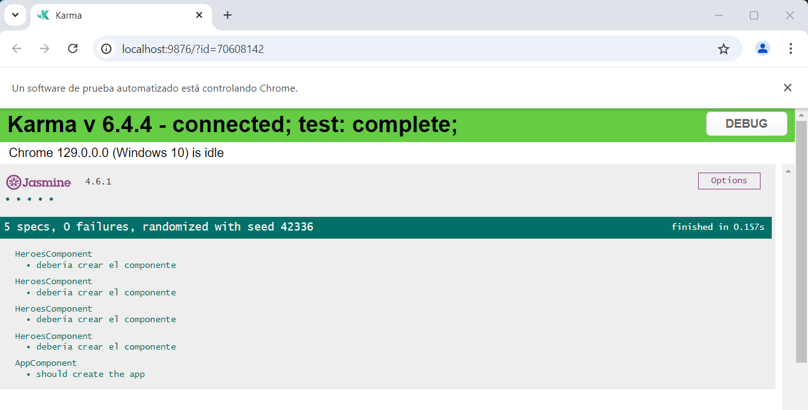
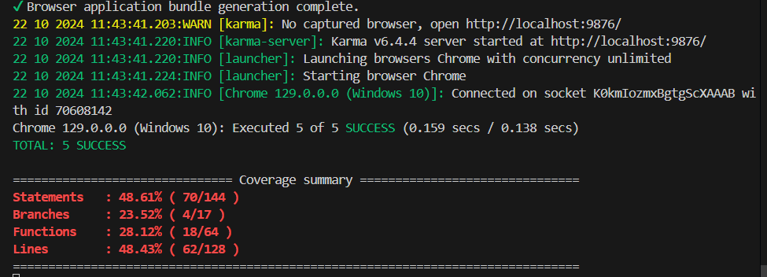

# Mindata RIU Challenge

Este proyecto fue generado con [Angular CLI](https://github.com/angular/angular-cli) versión 18.2.7.

## Servidor de desarrollo

Ejecuta `ng serve` para iniciar un servidor de desarrollo. 
Navega a `http://localhost:4200/`.  

La aplicación se recargará automáticamente si cambias alguno de los archivos fuente.
## Generación de código

Ejecuta `ng generate component component-name` para generar un nuevo componente.  
También puedes usar `ng generate directive|pipe|service|class|guard|interface|enum|module`.

## Construcción

Ejecuta `ng build` para construir el proyecto.  
Los artefactos de la construcción se almacenarán en el directorio `dist/`.

## Ejecución de pruebas unitarias

Ejecuta `ng test` para ejecutar las pruebas unitarias a través de [Karma](https://karma-runner.github.io).

### <u>Resultados:</u>

[Ver reporte coverage completo](https://marcoscolombo66.github.io/mindatachallenge/coverage/index.html).
## Ejecución de pruebas end-to-end

Ejecuta `ng e2e` para ejecutar las pruebas end-to-end a través de una plataforma de tu elección. Para usar este comando, primero necesitas agregar un paquete que implemente las capacidades de prueba end-to-end.

## <u>Observaciones</u>
### Interceptores
Agregue un interceptor para validar que en el listado de heroes al producirse un *error en la petición http*, se utilice una segunda URL.
La primera URL la deje con un error para poder probarlo, los mismos se observan en la consola del código, donde se muestran los mensajes.
### Directivas
Al crear o editar en la caja de texto del *nombre* del héroe, siempre se muestra en mayúscula.

## Ayuda adicional

Para obtener más ayuda sobre Angular CLI, usa `ng help` o consulta la página:  
[Angular CLI Overview and Command Reference](https://angular.dev/tools/cli).

